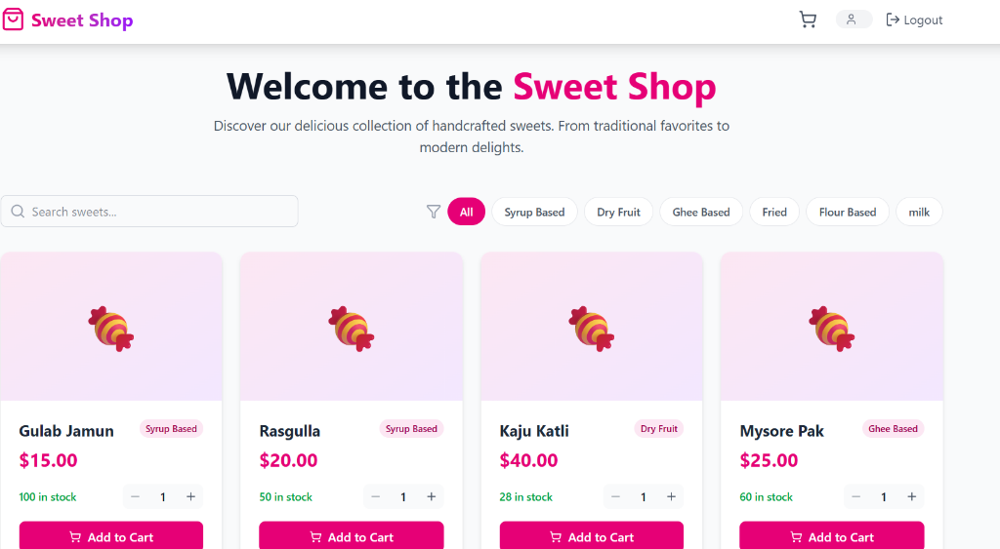
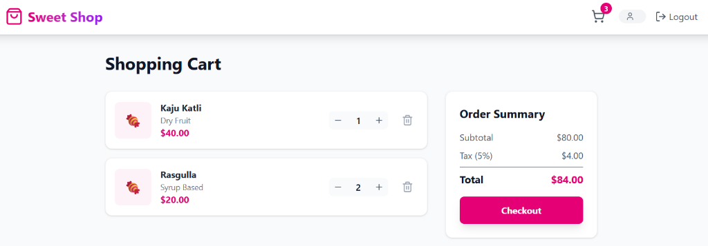
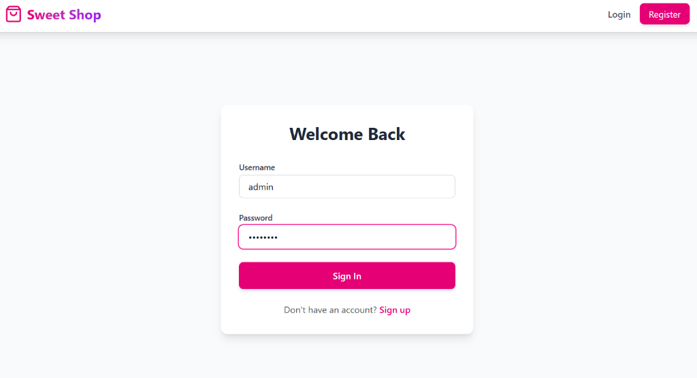
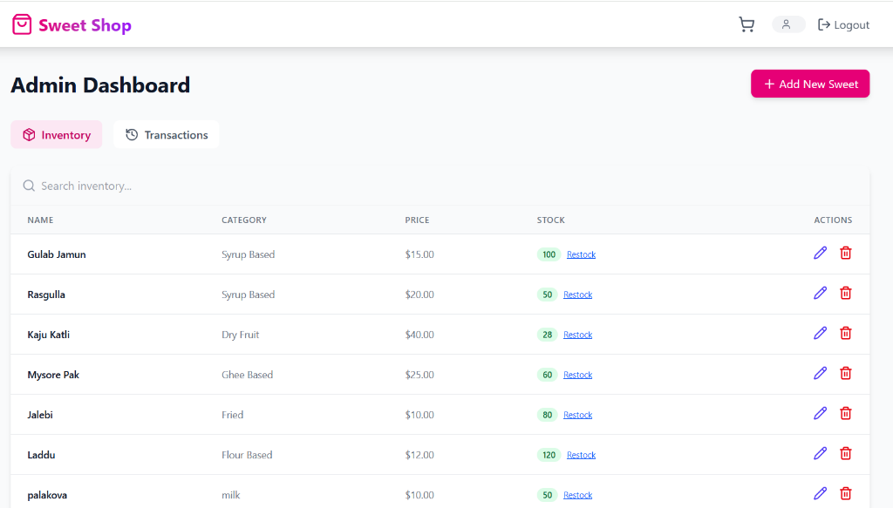
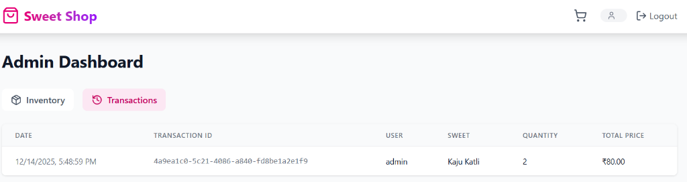

# Sweet Shop Management System

## Project Overview
The **Sweet Shop Management System** is a full-stack web application designed to streamline the operations of a sweet shop. It provides a comprehensive solution for managing inventory, processing customer orders, and tracking sales history. The system features role-based access control, allowing administrators to manage products and view transaction logs, while customers can browse sweets, manage their shopping cart, and place orders.

## Screenshots

### Home Page


### Shopping Cart


### Login Page


### Admin Dashboard - Inventory


### Admin Dashboard - Transactions


## Tech Stack

### Backend
- **Language**: Go (Golang)
- **Framework**: Gin Web Framework
- **Database**: SQLite (via GORM)
- **Authentication**: JWT (JSON Web Tokens)
- **Security**: Bcrypt for password hashing
- **Middleware**: CORS, Auth, Admin protection

### Frontend
- **Library**: React.js
- **Build Tool**: Vite
- **Styling**: Tailwind CSS
- **State Management**: React Context API (Auth & Cart)
- **Routing**: React Router DOM
- **HTTP Client**: Axios
- **UI Components**: Lucide React (Icons), Framer Motion (Animations), React Hot Toast (Notifications)

## Folder Structure

```
Sweet Shop Management System/
├── Backend/                    # Go Backend
│   ├── cmd/
│   │   └── server/             # Entry point (main.go)
│   ├── internal/
│   │   ├── database/           # Database connection & config
│   │   ├── handlers/           # API Controllers (Auth, Sweets, Inventory)
│   │   ├── middleware/         # Auth & Admin Middleware
│   │   ├── models/             # Database Structs (User, Sweet, Transaction)
│   │   └── routes/             # API Route Definitions
│   └── pkg/
│       └── utils/              # Helper functions (JWT, Password)
│
├── frontend/                   # React Frontend
│   ├── src/
│   │   ├── api/                # Axios configuration
│   │   ├── components/         # Reusable UI components
│   │   ├── context/            # Global State (AuthContext, CartContext)
│   │   └── pages/              # Page views (Home, Login, Cart, Admin)
│   └── public/                 # Static assets
│
└── start_app.ps1               # PowerShell script to start both servers
```

## Testing

### Manual Verification
1.  **User Flow**:
    - Register a new account.
    - Login to access the dashboard.
    - Browse sweets (Search/Filter).
    - Add items to cart (select quantity).
    - Proceed to checkout.
2.  **Admin Flow**:
    - Login with Admin credentials.
    - Access Admin Dashboard.
    - Add, Edit, or Delete sweets.
    - Restock inventory.
    - View Transaction History.

### API Testing
- **Public Endpoints**:
    - `GET /api/sweets`: List all sweets.
    - `GET /api/sweets/search`: Search sweets.
    - `POST /api/auth/register`: Register user.
    - `POST /api/auth/login`: Login user.
- **Protected Endpoints**:
    - `POST /api/sweets/:id/purchase`: Purchase item.
- **Admin Endpoints**:
    - `POST /api/sweets`: Add sweet.
    - `PUT /api/sweets/:id`: Update sweet.
    - `DELETE /api/sweets/:id`: Delete sweet.
    - `GET /api/admin/transactions`: View history.

## How to Setup

### Prerequisites
- **Go** (Golang) installed.
- **Node.js** and **npm** installed.

### Quick Start (Windows)
Run the provided PowerShell script to start both backend and frontend servers:
```powershell
./start_app.ps1
```

---

### Manual Setup

#### Backend Setup
1.  Navigate to the Backend directory:
    ```bash
    cd Backend
    ```
2.  Install dependencies:
    ```bash
    go mod tidy
    ```
3.  Run the server:
    ```bash
    go run cmd/server/main.go
    ```
    The backend will start on `http://localhost:8080`.
    *Note: The database (`sweetshop.db`) will be created and seeded automatically.*

#### Frontend Setup
1.  Navigate to the frontend directory:
    ```bash
    cd frontend
    ```
2.  Install dependencies:
    ```bash
    npm install
    ```
3.  Run the development server:
    ```bash
    npm run dev
    ```
    The frontend will start on `http://localhost:5173`.

   #### My AI Usage
Used ChatGPT to create a detailed and structured project plan.
Leveraged ChatGPT to understand best practices for building the project and to receive feedback on my project structure.
Utilized ChatGPT and DeepSeek to revise concepts such as token-based authentication and authorization.
Successfully configured JWT with ChatGPT’s guidance, using it to generate JwtUtils methods only.
Consulted ChatGPT to research Test-Driven Development (TDD), related tools, and how to apply them in my workflow.
Used ChatGPT to gain knowledge on testing different backend components.
Designed and validated the model with the help of ChatGPT to ensure validations were working as expected.
Used ChatGPT to learn about test case design and development, and created test cases for the service and user controller layers.
Utilized ChatGPT and DeepSeek to strengthen my understanding of frontend testing.
Used ChatGPT to generate test cases for UI components.
Leveraged ChatGPT for handling complex frontend state management scenarios.
Leveraged ChatGPT to get feedback and suggestions for optimizing business logic.
Used GitHub Copilot to analyze potential issues in business logic and improve code based on suggested best practices.
##### Reflection
Using AI tools like ChatGPT, DeepSeek, and Copilot significantly improved my workflow. They helped me quickly revise concepts, design test cases, and validate my implementation against best practices. AI served as both a coding assistant and a mentor by providing guidance, optimization strategies, and feedback. However, I carefully validated AI-generated code before integrating it to ensure correctness, maintainability, and alignment with project requirements. Overall, AI accelerated my development process while enhancing the quality of my code and tests.


